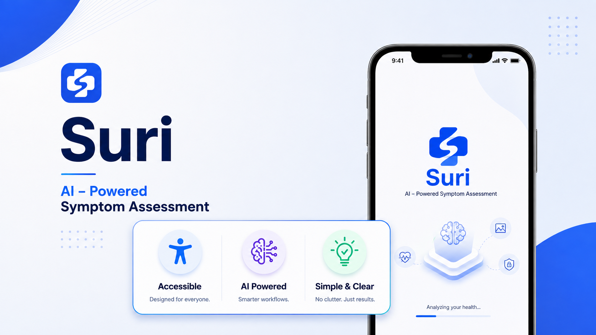
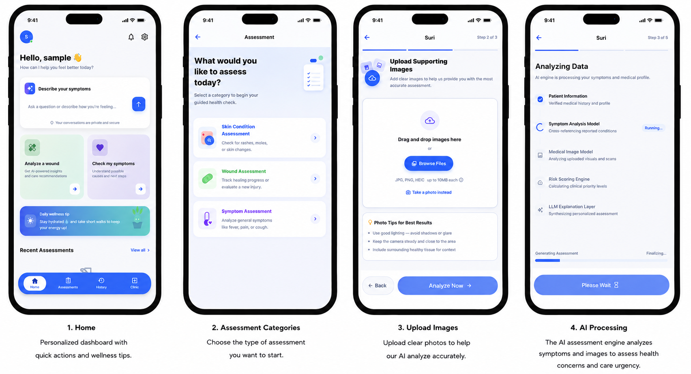

# Suri — AI-Powered Medical Assessment

**Suri** is an intelligent medical assessment and preliminary health triage platform designed to help users evaluate their health conditions, symptoms, and physical concerns. By combining **guided symptom questionnaires**, **OpenCV medical image quality gating**, **AI visual classification models**, and a **deterministic clinical rule engine**, Suri provides patients with rapid urgency recommendations, risk scores, and care guidance.

The mission of Suri is to make early health checkups accessible to everyone, helping users understand the severity of their symptoms and encouraging timely professional medical care.

> [!IMPORTANT]
> **Medical Disclaimer**: Suri is **not a replacement for a professional checkup or medical evaluation**. Instead, it is intended to **promote health awareness and encourage users to seek a timely checkup** with a qualified healthcare provider when appropriate.

---

## Application Preview



---

## 🌟 Key Features

* **Comprehensive Health Assessment**
  * Guided questionnaires covering symptoms, duration, medical history, and patient demographics for tailored health evaluation.

* **Medical Image & Quality Validation**
  * Support for uploading one or multiple medical/wound photographs.
  * Automated pixel-level quality checks (**blur detection**, **brightness**, and **contrast**) to ensure images are suitable for AI analysis.

* **AI-Driven Visual Classification**
  * Machine learning visual analysis to classify conditions, severity levels (*mild, moderate, severe*), healing stages, and physical indicators (redness, exudate, bleeding).

* **Urgency & Clinical Risk Assessment**
  * Deterministic rule engine evaluating combined patient context + visual observations to calculate risk levels (*Low, Moderate, High/Critical*).
  * Immediate emergency detection flags and clinical referral recommendations.

* **Care & Clinic Recommendations**
  * Actionable follow-up guidance and directions toward appropriate healthcare services and nearby clinics.

---

## 🏗️ Tech Stack

### **Backend**
* **Framework**: FastAPI (Python 3.11+)
* **Image Processing & ML**: OpenCV (`opencv-python-headless`), NumPy, Pydantic v2
* **Database & ORM**: PostgreSQL with SQLAlchemy & Alembic migrations
* **Caching**: Redis
* **Authentication**: JWT authentication

### **Mobile App**
* **Framework**: Flutter (Dart SDK ^3.12.2)
* **State Management**: Riverpod (`flutter_riverpod`)
* **Navigation**: GoRouter
* **Storage**: Flutter Secure Storage

---

## 📂 Repository Structure

```text
Suri/
├── backend/            # FastAPI backend service & API
├── mobile/             # Flutter mobile application
├── docker-compose.yml  # Local infrastructure services (Redis)
└── README.md           # Project documentation
```

---

## 🚀 Getting Started

For setup and execution instructions, please refer directly to the respective component directories:

* ⚙️ **Backend Service**: [backend/](./backend)
* 📱 **Mobile Application**: [mobile/](./mobile)

---

## ⚠️ Medical Disclaimer

> [!WARNING]
> **Suri is NOT a replacement for a professional checkup or medical evaluation.**

All health assessments, urgency recommendations, and visual classifications provided by Suri are intended strictly to **promote health awareness and encourage users to seek a timely checkup when appropriate**. They are for preliminary informational purposes only and do not constitute an official medical diagnosis. If you are experiencing severe symptoms, acute pain, heavy bleeding, or suspect a medical emergency, please contact qualified healthcare professionals or call your local emergency services immediately.
